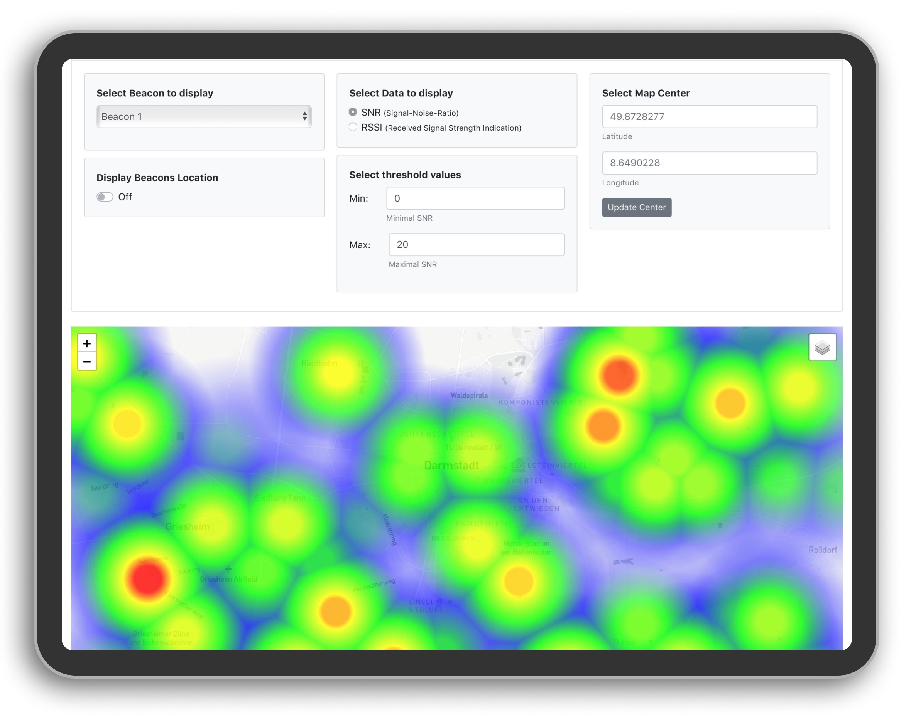

# LoRa Coverage Map Creation

A web application was created to visualize recorded signal quality data. The data is presented as a heat map.
A demo of the coverage map web application can be found on [index.html](index.html) and [here](https://reg-is.github.io/coverage-map/).

The frontend of the web application consist of two parts:
- On the top you have filter options to choose what data you want to display how on the map.
- On the bottom there is a map view, showing the coverage map chosen in the filter options.



## Important Files

### index.html
The `index.html` file contains the frontend for the coverage map web application. 

### script.js
The `assets/js/script.js` file contains all the functions and code to display the heat map and to make the filter option interactive.


### Data files 
To mock the recorded data, 1000 data points where generated with [Mockaroo](https://www.mockaroo.com). The data can be found in `assets/data/demo_data.js` and is formatted as JSON:

```json
[{
        "beaconID": 6,
        "packetID": 1,
        "latitude": 49.861697,
        "longitude": 8.601973,
        "rssi": -89,
        "snr": 12.82,
        "time": "2020-03-21T20:28:46Z"
    },
    {
        "beaconID": 2,
        "packetID": 5,
        "latitude": 49.897935,
        "longitude": 8.60256,
        "rssi": -37,
        "snr": 9.01,
        "time": "2020-05-08T07:57:33Z"
    },
    ...
]
```

The location of beacons are stored in `assets/data/demo_beacons.js` and formatted this way:

```json
[{
    "beaconID": 1,
    "latitude": 49.902525,
    "longitude": 8.564788,
    "description":  "This is the location of a mock beacon."
  }, 
  ...
]
```

## Dependencies
The following dependencies were used for the coverage map generation: 
- [Leaflet 1.7.1](https://leafletjs.com)
- [Woracheth/heatmap.js](https://github.com/Woracheth/heatmap.js)
- [jQuery 3.5.1](https://jquery.com/download/)
- [Bootstrap 4.5.2](https://getbootstrap.com)

### Leaflet
Leaflet was used to display the map on the webpage, it was used because it is open source and highly customizable.


###  heatmap.js leaflet plugin
To generate the heat map the leaflet plugin [heatmap.js](https://github.com/pa7/heatmap.js) was use. More precicley a fork of heatmap.js by [Woracheth](https://github.com/Woracheth/heatmap.js). It resolves the issue of the original repository where multiple points at the same position would increase the intensity. In our case we want that multiple points are averaged.

#### Alternative solution: Leaflet.heat plugin
An alternative leaflet-plugin for creating heat maps is `Leaflet.heat`. This solution was tested but finally not used because it has the unwanted behavior adding up values of multiple points at the same location instead of averaging them. 

### Bootstrap
For the frontend [Bootstrap](https://getbootstrap.com) is used. The individual filter options added as bootstrap cards, that are arranged differently, depending the devices screen size.

## Future work and Improvements
The coverage map can be improved in different ways:
- Fine tune radius and blur factor and maybe add option to change it manually in the frontend.
- Filters could be added, such as the options to display only data within a given date range, or a selected season.
- For parts of the coverage map with no data about the quality of the received signal, values could be interpolated using heuristics.
- In order to be able to make a good statement about the best position for a base station, one must take into account the individual coverage maps of all beacons.
For this it would be beneficial if the signal qualities of all beacons were compiled in a single coverage map.
- Make the web application offline compatible, for use in forests.